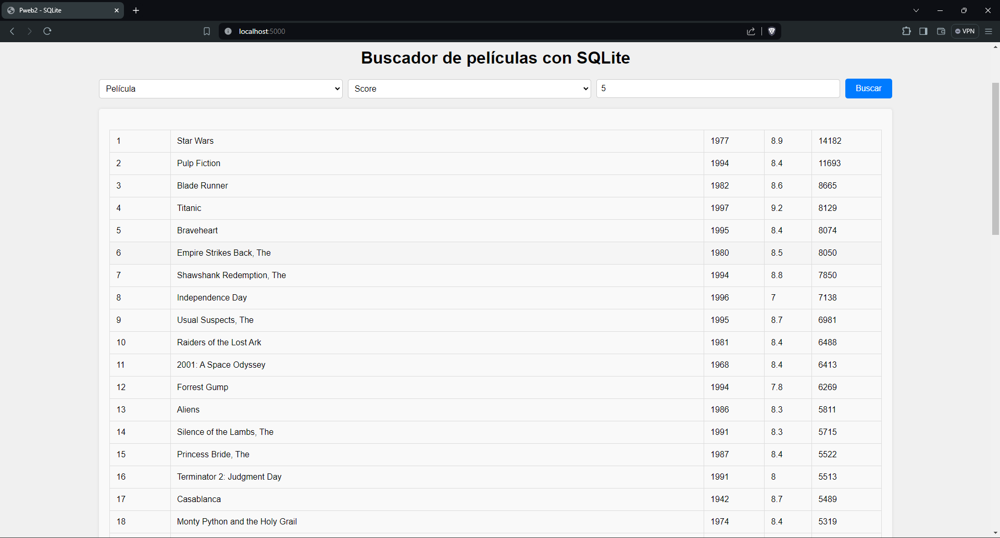

# Buscador de películas

Este es un buscador de películas desarrollado utilizando Python, SQLite, AJAX y JSON.

## Descripción

El buscador de películas es una aplicación web que permite a los usuarios buscar información sobre películas almacenadas en una base de datos SQLite. Utiliza tecnologías web modernas como AJAX para realizar búsquedas en tiempo real sin necesidad de recargar la página.

## Captura de pantalla

